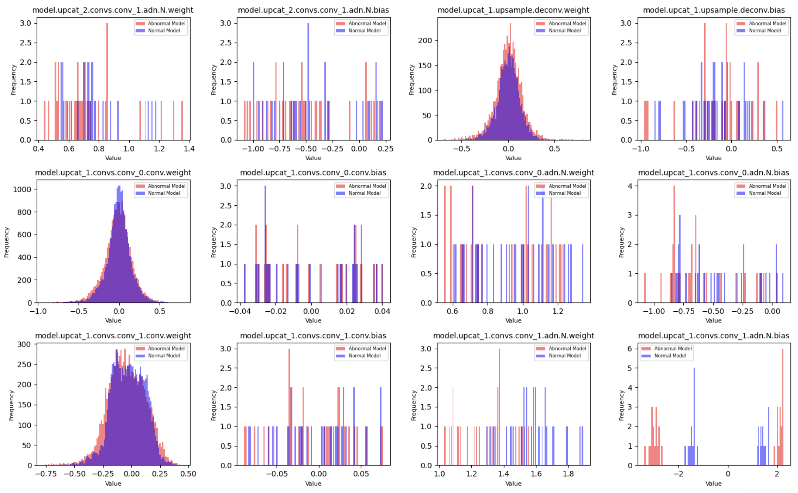

[English](README.md)

## UNethology 🐚：探索 UNet 应用 🧬

欢迎来到 **UNethology**，这是一个专门展示 UNet 多样性的仓库，UNet 是一种强大的深度学习架构，用于图像分割等领域。在这个仓库中，我深入探讨了利用 UNet 解决各种问题的过程，展示了其在不同领域的适应性和有效性。

**最近更新：** 🏆

* **2024年11月7日：** [如何确认异常模型哪里坏了？](Brain_Tumor_Segmentation_UNet/diagnose_dice_sharp_drop_problem.ipynb)

* **2024年11月5日：** [如何可视化特征图。](Brain_Tumor_Segmentation_UNet/how_to_get_features_map.ipynb)

* **2024年11月4日：** 全面的 Jupyter 笔记本，详细描述了在 MRI 图像上对脑肿瘤进行分割的 UNet 训练过程。这个笔记本涵盖了数据加载、数据集和数据加载器的创建、使用 MONAI 的 BasicUNet 进行模型设置，以及使用 PyTorch Lightning 的训练流程。该项目突出了将 UNet 与先进的医学成像框架集成，以实现精确的分割任务。你可以通过 [Brain_Tumor_Segmentation_UNet/data_get.ipynb](Brain_Tumor_Segmentation_UNet/data_get.ipynb) 获取数据，
在 [Brain_Tumor_Segmentation_UNet/train.ipynb](Brain_Tumor_Segmentation_UNet/train.ipynb) 中进行训练。我在这里写得非常详细，包括如何处理数据、可视化预测数据等等，我日后会常更新。

* **2024年5月6日：** 添加了一个新的项目，展示了在 SMU 数据集上用于医学图像分割的 UNet。查看笔记本：[SMU 数据集：UNet 用于医学图像分割](https://www.kaggle.com/code/liaoguoying/smu-dataset-dl-update-with-new-dataset)。在这个项目中，我使用 smp 构建了基于 ViT 的 UNet 并与 ResUNet 进行比较。此外，还应用了 [一种新颖的损失函数](https://github.com/lgy112112/DiceCELossWithKL)。

* **2024年4月15日：** 成功地将 UNet 应用于 Kaggle 上的回归预测挑战，特别是 [预测鲍鱼的年龄](https://www.kaggle.com/competitions/playground-series-s4e4)。查看 Kaggle 笔记本：[UNethology：用 UNet 预测年龄？？？](https://www.kaggle.com/code/liaoguoying/unethology-predict-age-with-unet)。

**敬请期待更多的 UNet 冒险！** 🚀

在我继续探索 UNet 能力的同时，我将向这个仓库添加更多项目和见解。欢迎跟随并加入我这个激动人心的 UNet 驱动的问题解决之旅！🤓

**项目：**

* **MRI 图像上的脑肿瘤分割：** 详细介绍了设置 UNet 用于 MRI 扫描中脑肿瘤分割的步骤，利用 PyTorch Lightning 和 MONAI 实现高效的训练和评估。
* **SMU 数据集：UNet 用于医学图像分割** - 展示了 UNet 在 SMU 数据集上的医学图像分割能力，展示了其在医学图像分析中的潜力。
* **UNethology：用 UNet 预测年龄？？？** - 一个 Kaggle 笔记本，展示了如何将 UNet 适应于回归预测任务————预测鲍鱼的年龄。

